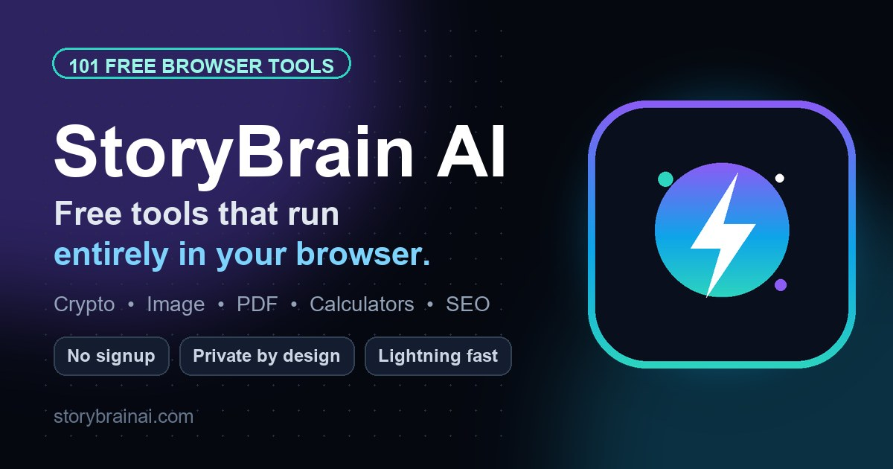

# StoryBrain AI

[](https://www.storybrainai.com/)



**[StoryBrain AI](https://www.storybrainai.com/)** is a production-grade, lightning-fast SaaS platform offering 107 free browser-based tools. It includes AI utilities, crypto calculators, image processors, PDF generators, and business calculators.

The platform is engineered for absolute maximum performance (100/100 Core Web Vitals) featuring an enterprise architecture built on FastAPI, Jinja2, and TailwindCSS.

## 🚀 Enterprise Performance Architecture
- **Speculation Rules API:** Zero-millisecond (0ms) predictive prerendering on hover.
- **Zero-Byte CSS:** Tailwind `app.css` is strictly cached and version-busted on the backend for minimal TTFB.
- **Hydration-Free Frontend:** No heavy JS frameworks (React/Vue/Angular). Vanilla JS ensures zero main-thread blocking.
- **Lazy Loading:** Analytics and ads are debounced to guarantee 100/100 Lighthouse performance.

## 🛠️ Tech Stack

### Backend
- **Python 3.11+**
- **FastAPI** (High-performance API routing and middleware)
- **Jinja2** (Server-side HTML rendering)
- **Uvicorn & Gunicorn** (ASGI server and process manager)
- **SQLite** (Analytics tracking and storage)

### Frontend
- **HTML5 & Vanilla JavaScript**
- **TailwindCSS v4**
- **DaisyUI v5**

### Infrastructure
- **Hostinger VPS** (Ubuntu OS)
- **Caddy** (reverse proxy with automatic HTTPS — see `Caddyfile`)
- **Systemd** (`storybrain-ai.service` runs Gunicorn on port 8090)
- **Cloudflare** (CDN, Brotli Compression, HTTP/3 QUIC)

---

## 💻 Local Development

### Prerequisites
- Python 3.11+
- Node.js (for TailwindCSS building)
- GNU Make (optional, for automation)

### Quick Start
1. **Clone the repository:**
   ```bash
   git clone https://github.com/shishirbuksh/tool-website.git
   cd tool-website
   ```

2. **Run the Make command:**
   ```bash
   make run
   ```
   *This automatically installs dependencies, builds frontend assets, and starts the server.*

### Manual Start (Windows/No Make)
1. **Install Python dependencies:**
   ```bash
   pip install -r requirements.txt
   ```
2. **Install Node dependencies & build CSS:**
   ```bash
   npm ci
   npm run build
   ```
3. **Start the FastAPI server:**
   ```bash
   python -m uvicorn app.main:app --host 127.0.0.1 --port 8090 --reload
   ```

---

## 🧪 Testing
The project includes a robust, 100+ unit test suite managed by `pytest`.

```bash
# Run all tests
make test

# Or manually:
python -m pytest tests/ -v
```

> **Note:** The test suite generates an isolated SQLite database (`test_analytics.db`) in your system's temp directory to prevent any destructive mutations to production data.

---

## 🚢 Production Deployment

StoryBrain AI uses a seamless deployment script optimized for Hostinger VPS (Ubuntu).

1. SSH into your VPS.
2. Navigate to the repository directory.
3. Run the automated deployment pipeline:
   ```bash
   sudo bash deploy.sh
   ```

This script will automatically pull the latest `main` branch, rebuild assets, restart the Gunicorn workers via Systemd, and flush any necessary caches.

### Environment, Caddy & Systemd
- **Layout:** HTML templates live in `templates/` and static assets in `static/` (both at the repo root — not under `app/`). Tool pages are `templates/tools/<slug_with_underscores>.html` for each slug in `data/tools.yaml`.
- **Env:** copy `.env.example` to `.env` and set `SECRET_KEY`, `ALLOWED_HOSTS`, `CORS_ORIGINS`, plus `CADDY_DOMAIN` / `CADDY_PROXY_UPSTREAM` / `CADDY_STATIC_ROOT` (must equal `$APP_DIR/static`), `FORWARDED_ALLOW_IPS=127.0.0.1`, and `U2NET_HOME`. `deploy.sh` auto-generates `SECRET_KEY` if missing and persists `APP_VERSION` to `.env`.
- **Caddy:** `Caddyfile` reverse-proxies to Gunicorn on `127.0.0.1:8090`, serves `/static/*` from `CADDY_STATIC_ROOT`, and serves `/sw.js` with `Service-Worker-Allowed: /`. Override the apex domain with `CADDY_DOMAIN`.
- **Systemd:** `storybrain-ai.service` loads `{{APP_DIR}}/.env` via `EnvironmentFile`, runs `gunicorn app.main:app -c gunicorn_conf.py` as the `storybrainai` user, and sets `U2NET_HOME={{APP_DIR}}/.u2net`.

---

## 📄 License
Copyright (c) 2026 StoryBrain AI. All rights reserved.
